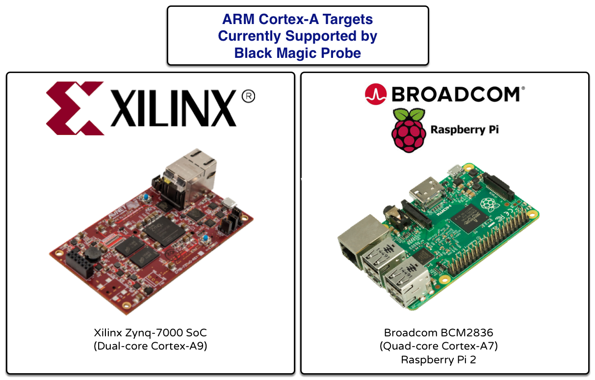

<!-- Black Magic Debug documentation master file, created by
   sphinx-quickstart on Fri Jul  1 21:16:13 2022.
   You can adapt this file completely to your liking, but it should at least
   contain the root `toctree` directive.
-->

```{toctree}
:hidden:
:maxdepth: 1
:caption: Intro

hardware
getting-started
upgrade
```

```{toctree}
:hidden:
:maxdepth: 1
:caption: Knowledgebase

knowledge/faq
knowledge/terminology
knowledge/links
```

```{toctree}
:hidden:
:maxdepth: 1
:caption: Usage

usage/gdb-commands
usage/gdb-automation
usage/semihosting
usage/traceswo
usage/swo
usage/platformio
```

```{toctree}
:hidden:
:maxdepth: 1
:caption: Target Specific Usage

target-usage/stm32
target-usage/sam3x-4x-x7x
```


```{toctree}
:hidden:
:maxdepth: 1
:caption: Hacking

hacking/contrib
hacking/hacking
hacking/target-drivers
hacking/target-cortex-m
hacking/target-cortex-a
```

[](https://github.com/blackmagic-debug/blackmagic/releases)
[](https://github.com/blackmagic-debug/blackmagic/actions/workflows/build-and-upload.yml)
[](https://github.com/blackmagic-debug/blackmagic/stargazers)
[](https://discord.gg/P7FYThy)

# Black Magic Debug: The Plug&Play MCU Debugger


## Black Magic Debug Project Goals
The goal of this project is the creation of an easy to use. Mostly plug and play, JTAG/SWD debugger for embedded microcontrollers. Focusing on professional embedded software developers that prefer retaining control over their build systems and testing environments instead of relying on highly abstracted vendor tools that give the impression of simplicity at the cost of transparency.

## Project News
```{postlist} 10

```

## What is Black Magic Debug

In most cases Black Magic Debug takes the form of a firmware for the Black Magic Probe hardware, and implements a [GNU DeBugger (GDB)](https://www.sourceware.org/gdb/) server.

The Black Magic GDB server features:
* Automatic target detection
* No need for target specific configuration scripts
* All protocol and target specific control is done through GDB monitor commands
* No "software in the middle" like OpenOCD required
* Easily scriptable thanks to the [GDB scripting](https://sourceware.org/gdb/onlinedocs/gdb/Command-Files.html) capabilities
* Interface to the host computer is a standard USB CDC ACM device (virtual serial port), which does not require special drivers on Linux or OS X.
* Targets ARM Cortex-M and Cortex-A based microcontrollers
* Provides full debugging functionality, including: watchpoints, flash memory breakpoints, memory and register examination, flash memory programming, etc.
* [Semihosting / Host IO support] as well as [Serial Wire Debug TRACESWO support].
* Implements USB DFU class for easy firmware upgrade as updates become available.
* Works with Windows, Linux and Mac environments.

All you need is to install the GNU [cross compilation toolchain](https://en.wikipedia.org/wiki/Cross_compiler) installed, containing [GCC](https://gcc.gnu.org/) and [GDB](https://www.sourceware.org/gdb/) for your microcontroller installed, the microcontroller is supported by BMD, plug in the Black Magic Probe hardware running the Black Magic Debug firmware into your computer, and instruct your GDB to use the BMP as your remote target using the `target extended_remote *serial_port*` command and you are off to the races.

If you are an embedded development beginner Black Magic Probe is also a great choice for you. But expect more of a Unix command line experience than a Windows [*klickybunti*](https://www.urbandictionary.com/define.php?term=klickibunti) GUI.

If there is anything unclear or hard to understand let us know. Our goal is to make the documentation on this website comprehensive enough that it is all you need to get started with microcontroller development and debugging using the Black Magic Probe.

## Supported Targets

[](_assets/bmpm_ARM_Cortex-M_targets-2021-12.png)
[](_assets/bmpm_ARM_Cortex-A_alpha_targets.png)

## Quick Demo

Here is a quick example of a GDB session using the Black Magic Probe.

```{asciinema} _assets/bmp_demo.cast
:preload: 1
:font-size: 15px
:theme: monokai
```

The session goes through the following steps:
* Connecting to BMP -> `target extended remote <serial port>`
* Scanning for targets using SWD -> `monitor swdp_scan`
* Attaching to the detected target -> `attach 1`
* Loading the project binary -> `load`
* Starting the firmware with a breakpoint set to the start of the `main` function -> `start`
* Stepping over the `main` function -> `next`,`[enter,...]`
* Continuing execution -> `continue`
* Breaking and detaching from the target -> `CTRL-C, CTRL-D`

## Support the Project

The best way to support the project is purchasing the official [Black Magic Probe hardware](#getting-hardware). If you would like to support the project beyond that please consider supporting these individuals and organizations:
* [Piotr Esden-Tempski (GitHub Sponsors)](https://github.com/sponsors/esden)
* [Rachel Mant (GitHub Sponsors)](https://github.com/sponsors/dragonmux)
* [1BitSquared (Patreon)](https://www.patreon.com/1bitsquared)

## Getting Hardware

The official Black Magic Probe hardware was specifically designed with Black Magic Debug in mind and the proceeds from the sales directly support and further the development of the software. See the [Support the Project](#support-the-project) section for other means of sponsoring the development of Black Magic Debug.

The official Black Magic Probe hardware is available from these distributors in alphabetical order:
 * DE: [1BitSquared Germany](http://1bitsquared.de/products/black-magic-probe) Black Magic Probe V2.3 (Newest)
 * USA: [1BitSquared US](http://1bitsquared.com/collections/frontpage/products/black-magic-probe) Black Magic Probe V2.3 (Newest)
 * USA: [Adafruit Industries](https://www.adafruit.com/product/3839) Black Magic Probe with JTAG Cable and Serial Cable - V2.3 (Newest)

## Other Hardware supported by Black Magic Debug:
 * Stlink V2.1 and V3 based boards with a BMDA variant of the BMD (`PROBE_HOST=pc-stlinkv2`)
 * LibFTDI based based boards boards with a BMDA variant of the BMD (`PROBE_HOST=libftdi`)
 * StlinkV2 based boards with BMD ST-Link firmware (`PROBE_HOST=stlink ST_BOOTLOADER=1`) flashed with [stlink-tool](https://github.com/jeanthom/stlink-tool.git) to unmodfied board, see [Readme.md](https://github.com/blacksphere/blackmagic/tree/master/src/platforms/stlink).
 * StlinkV2 based boards with BMD ST-Link firmware (`PROBE_HOST=stlink`) with BMD own bootloader flashed to the board.
 * STM8S Discovery (StlinkV1) and Bluepill board with BMD SW-Link firmware (`PROBE_HOST=swlink`)
 * F4 Discovery (STM32F407) with BMD f4discovery firmware (`PROBE_HOST=f4discovery`)
 * Blackpill V2 (STM32F411) (`PROBE_HOST=blackpillv2`)
 * launchpad-icdi with BMD launchpad-icdi firmware (`PROBE_HOST=launchpad-icdi`)
 * Hydrabus(?) (`PROBE_HOST=hydrabus`)
 * TM4C(?) (`PROBE_HOST=tm4c`)

## Black Magic Debug App (BMDA)

You can also compile the Black Magic Debug as a stand alone application instead of a firmware that you can flash onto a microcontroller. This mode resembles the way OpenOCD is used as an "application in the middle".

To compile BMDA you need to run `make PROBE_HOST=hosted`. The resulting application can be run on your computer and is able to detect all kinds of hardware probes including:
* Black Magic Probe
* FTDI adapters
* CMSIS_DAP capable debuggers
* JLink (slow)
* ST-Link V2/V3

## Contact:
* If you have questions or suggestions feel free to join us in our chat [](https://discord.gg/P7FYThy)
